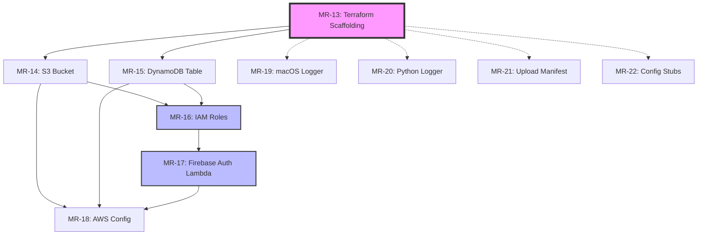

# Phase 2 (Foundational) Execution Plan

**Status**: Ready to Start
**Date**: 2025-11-10
**Epic**: MR-1 (Meeting Recorder with AI Intelligence)

## Overview

Phase 2 establishes the core infrastructure that **MUST be complete before ANY user story can be implemented**. This phase creates the AWS resources, authentication flow, and foundational services required for the entire application.

## Checkpoint Goal

Foundation ready — user story implementation can begin in parallel once Phase 2 is complete.

## Task Breakdown

### Group 1: Infrastructure Foundation (Start Here)

**Priority**: CRITICAL - Blocks all other work

#### MR-13 (T006) - Create Terraform scaffolding
- **File**: `infra/terraform/main.tf`
- **Dependencies**: None
- **Deliverables**:
  - Terraform providers configuration (AWS, random)
  - Backend configuration (S3 state, DynamoDB lock)
  - Variables file structure
  - Output definitions
- **Estimated Time**: 30 minutes

---

### Group 2: Core AWS Resources (Parallel Execution)

**Priority**: HIGH - Required for all user stories

These tasks can be executed **in parallel** after MR-13 is complete:

#### MR-14 (T007) - Define S3 bucket
- **File**: `infra/terraform/s3.tf`
- **Dependencies**: MR-13
- **Deliverables**:
  - S3 bucket with `users/{user_id}/` prefix structure
  - SSE-S3 encryption enabled
  - TLS-only bucket policy
  - Versioning and lifecycle policies
- **Estimated Time**: 45 minutes

#### MR-15 (T008) - Define DynamoDB table
- **File**: `infra/terraform/dynamodb.tf`
- **Dependencies**: MR-13
- **Deliverables**:
  - Table: `meetings`
  - Primary Key: `user_id#recording_id` (composite)
  - GSI-1: `DateSearch` (by user_id + created_at)
  - Pay-per-request billing
  - Point-in-time recovery enabled
- **Estimated Time**: 45 minutes

#### MR-16 (T009) - Define IAM roles/policies
- **File**: `infra/terraform/iam.tf`
- **Dependencies**: MR-13, MR-14, MR-15
- **Deliverables**:
  - macOS app role (S3 + DynamoDB access)
  - Lambda execution roles (per function)
  - Least-privilege policies
  - Deny non-TLS policy enforcement
- **Estimated Time**: 1 hour

---

### Group 3: Authentication (Sequential)

**Priority**: HIGH - Required for app functionality

#### MR-17 (T010) - Implement Firebase → STS credentials exchange Lambda
- **File**: `processing/lambdas/auth_exchange/handler.py`
- **Dependencies**: MR-16 (IAM roles)
- **Deliverables**:
  - Lambda handler to exchange Firebase ID token for AWS STS credentials
  - Token validation logic
  - 1-hour session token generation
  - Error handling and logging
- **Estimated Time**: 1.5 hours

---

### Group 4: Configuration & Logging (Parallel Execution)

**Priority**: MEDIUM - Required before user story implementation

These tasks can be executed **in parallel**:

#### MR-18 (T011) - macOS AWS config constants
- **File**: `macos/Services/AWSConfig.swift`
- **Dependencies**: MR-14, MR-15, MR-17
- **Deliverables**:
  - AWS region constant
  - S3 bucket name
  - DynamoDB table name
  - Identity provider endpoint (Firebase auth Lambda)
  - Environment-specific configuration
- **Estimated Time**: 30 minutes

#### MR-19 (T012) - macOS structured logger
- **File**: `macos/Services/Logger.swift`
- **Dependencies**: None
- **Deliverables**:
  - Structured logging utility
  - Log levels (debug, info, warn, error)
  - No PII logging enforcement
  - JSON-formatted output
- **Estimated Time**: 45 minutes

#### MR-20 (T013) - Shared Python logging helper
- **File**: `processing/shared/logging.py`
- **Dependencies**: None
- **Deliverables**:
  - Python logging utility for Lambdas
  - JSON structured logs
  - No PII enforcement
  - CloudWatch integration
- **Estimated Time**: 30 minutes

#### MR-21 (T014) - Define local upload manifest model
- **File**: `macos/Models/UploadManifest.swift`
- **Dependencies**: None
- **Deliverables**:
  - Swift model for tracking upload state
  - Fields: chunk_id, path, size, checksum, attempts, last_error
  - Codable conformance for persistence
- **Estimated Time**: 30 minutes

#### MR-22 (T015) - Config management stubs
- **Files**:
  - `macos/Services/Config.swift`
  - `processing/shared/config.py`
- **Dependencies**: None
- **Deliverables**:
  - Configuration management structure
  - Environment variable loading
  - Default values
  - Validation logic
- **Estimated Time**: 45 minutes

---

## Execution Strategy

### Sequential Approach (Conservative)
```
MR-13 → [MR-14, MR-15] → MR-16 → MR-17 → [MR-18, MR-19, MR-20, MR-21, MR-22]
Total Time: ~7-8 hours
```

### Parallel Approach (Optimal)
```
Day 1:
  MR-13 (30min)
  ↓
  Parallel: MR-14 + MR-15 (45min each)
  ↓
  MR-16 (1hr, depends on 14 + 15)
  ↓
  MR-17 (1.5hr, depends on 16)

Day 2:
  Parallel: MR-18 + MR-19 + MR-20 + MR-21 + MR-22
  (All can run in parallel, ~45min total)

Total Time: ~4-5 hours with parallel execution
```

### Recommended Workflow

1. **Create feature branch**: `MR-1-phase2-foundational`
2. **Commit strategy**: One commit per ticket for clear history
3. **Testing**: Validate Terraform with `terraform plan` before moving forward
4. **Review**: Run linters (swiftlint, ruff) before committing
5. **Documentation**: Update README.md status after phase completion

---

## Dependencies Graph



**Legend:**
- Solid arrows: Hard dependencies (must complete before starting)
- Dashed arrows: Soft dependencies (can start in parallel)
- Purple: Critical path start
- Blue: Critical path continuation

---

## Success Criteria

Phase 2 is complete when:

- ✅ All Terraform resources deploy successfully (`terraform apply`)
- ✅ IAM roles and policies validated with AWS IAM Policy Simulator
- ✅ Firebase auth Lambda can exchange tokens for AWS credentials
- ✅ macOS app can load AWS configuration
- ✅ Logging utilities tested and operational
- ✅ All code passes linters (swiftlint, ruff)
- ✅ All files committed and pushed to feature branch

---

## Cleanup Tasks

After Phase 2 completion:

- [ ] Close completed Phase 1 tickets (MR-10, MR-12) in Jira
- [ ] Update Jira epic status
- [ ] Update README.md implementation status
- [ ] Create PR for `MR-1-phase2-foundational` branch
- [ ] Tag release: `v0.2.0-phase2-foundational`

---

## Notes

- **AWS Costs**: Terraform state backend requires S3 bucket and DynamoDB table (minimal cost)
- **Firebase Setup**: Requires Firebase project creation and Google Sign-In configuration
- **Local Testing**: Use `terraform plan` extensively before `apply`
- **State Management**: Consider remote state backend for team collaboration

---

**Next Phase**: Phase 3 - User Story 1 (Recording with consent and indicator)
