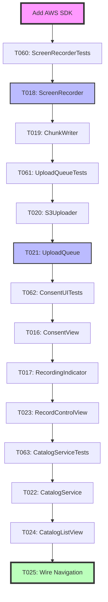

# Phase 3 (User Story 1) Execution Plan

**Status**: Ready to Start
**Date**: 2025-11-12
**Epic**: MR-1 (Meeting Recorder with AI Intelligence)
**User Story**: Recording & Consent (Priority P1) 🎯

## Overview

Phase 3 implements the first complete user story: screen recording with consent, persistent indicator, chunk upload to S3, and basic catalog entry. This phase delivers end-to-end functionality that users can interact with.

**Tasks**: T016-T025 + T060-T063 (14 tasks: 10 implementation + 4 tests)

## Checkpoint Goal

Users can record their screen with explicit consent, see a persistent recording indicator, and have chunks automatically uploaded to S3 with basic catalog entries in DynamoDB.

---

## Key Architectural Requirements

### From Data Model & Storage (Confluence)

#### Multi-Tier Storage Architecture
- **S3**: Raw video chunks, processed videos, audio, transcripts, summaries
- **DynamoDB**: Meeting metadata and search indexes
- **Local macOS**: Temporary chunks during recording (`~/Library/Caches/MeetingRecorder/`)

#### S3 Storage Layout
```
s3://meeting-recordings-bucket/
  users/{user_id}/
    chunks/{recording_id}/part-0001.mp4, part-0002.mp4...
    videos/{recording_id}.mp4
    audio/{recording_id}.mp3
    transcripts/{recording_id}.json
    summaries/{recording_id}.json
```

#### DynamoDB Schema
- **Primary Key**: `user_id#recording_id` (ensures user isolation)
- **Sort Key**: `METADATA` (allows future item types)
- **Key Attributes**: user_id, recording_id, title, participants, tags, created_at, duration_ms, status, s3_paths, costs, redactions
- **3 Global Secondary Indexes**:
  - GSI-1 (DateSearch): PK=user_id, SK=recorded_at
  - GSI-2 (ParticipantSearch): PK=user_id#participant, SK=recorded_at (denormalized)
  - GSI-3 (TagSearch): PK=user_id#tag, SK=recorded_at (denormalized)

#### Critical Data Requirements
- **60-second chunk segmentation** (hardcoded, not configurable yet)
- **SHA-256 checksums** for chunk integrity
- **Upload manifest** for resumable uploads (JSON format)
- **Status tracking**: pending → uploading → processing → completed/failed

### From Technical Architecture (Confluence)

#### Authentication Flow
- Firebase Auth with Google Sign-In
- macOS app → Firebase ID token → Lambda (auth_exchange) → STS AssumeRole → Temporary AWS credentials (1-hour TTL)
- Cross-device sync via shared Firebase account

#### macOS App Stack
- Swift 6.1 + AVFoundation for screen capture
- SwiftUI for UI
- AWS SDK for Swift (direct S3/DynamoDB access, no API layer)
- 60-second chunk segmentation

#### Upload Strategy
- S3 multipart upload for each 60s chunk
- Background retry with exponential backoff (1s → 60s max, 3 max attempts)
- Local `manifest.jsonl` tracks upload state
- Resume incomplete uploads on app restart

#### Security Architecture
- **Encryption at rest**: SSE-S3 (AES-256), DynamoDB encryption
- **Encryption in transit**: TLS 1.2+ enforced
- **User isolation**: IAM policy restricts to `users/${user_id}/*`
- **No PII in logs**

---

## Current Codebase State

### ✅ Infrastructure (Phase 2 Complete)

**Deployed Terraform Resources:**
- `infra/terraform/s3.tf` - S3 bucket with SSE-S3, TLS-only, lifecycle rules, CORS
- `infra/terraform/dynamodb.tf` - DynamoDB table with 3 GSIs, PITR, encryption
- `infra/terraform/iam.tf` - Firebase OIDC, macOS app role, S3/DynamoDB policies

### ✅ Foundational Models & Services

**Existing Files:**
- `macos/Sources/MeetingRecorder/Models/UploadManifest.swift` - Upload tracking model (T014)
- `macos/Sources/MeetingRecorder/Services/AWSConfig.swift` - AWS configuration (T011)
- `macos/Sources/MeetingRecorder/Services/Logger.swift` - Structured logger (T012)
- `macos/Sources/MeetingRecorder/Services/Config.swift` - Config management (T015)

### ⚠️ Missing Components (Phase 3 Work)

**Directories to Create:**
- `macos/Sources/MeetingRecorder/Recording/` - ScreenRecorder, ChunkWriter
- `macos/Sources/MeetingRecorder/UI/` - Consent, indicator, controls, catalog views
- `macos/Tests/` - Unit tests for recording and upload
- `macos/UITests/` - UI tests for consent and indicator

---

## Task Breakdown - 4 PR Groups

### PR Group 1: Setup & Recording Infrastructure ⭐ START HERE

**Branch**: `MR-18-recording-infrastructure`
**Tasks**: Setup + T060 + T018 + T019 (4 items)

#### 1. Add AWS SDK Dependencies

**File**: `macos/Package.swift`

Add AWS SDK for Swift packages:
```swift
dependencies: [
    .package(url: "https://github.com/awslabs/aws-sdk-swift.git", from: "0.40.0"),
    .package(url: "https://github.com/firebase/firebase-ios-sdk.git", from: "10.0.0")
]
```

Include specific products:
- AWSS3
- AWSDynamoDB
- AWSSTS
- FirebaseAuth

**Verification**: `swift build` succeeds

#### 2. T060: Write ScreenRecorderTests.swift

**File**: `macos/Tests/ScreenRecorderTests.swift`

Test cases:
- ✅ Test 60-second chunk segmentation
- ✅ Test recording start/stop/pause/resume state transitions
- ✅ Test frame rate and resolution configuration (1080p @ 30-60fps)
- ✅ Test error handling (permission denied, disk full)
- ✅ Test multiple chunk generation (3-minute recording → 3 chunks)
- ✅ Test proper cleanup on cancellation
- ✅ Test memory management (no leaks during long recordings)

**TDD Approach**: Write tests first, expect failures, then implement ScreenRecorder

#### 3. T018: Implement ScreenRecorder.swift

**File**: `macos/Sources/MeetingRecorder/Recording/ScreenRecorder.swift`

**Class Structure**:
```swift
@MainActor
class ScreenRecorder: ObservableObject {
    @Published var isRecording: Bool = false
    @Published var isPaused: Bool = false
    @Published var currentChunkIndex: Int = 0
    @Published var recordingDuration: TimeInterval = 0

    private var captureSession: AVCaptureSession?
    private var assetWriter: AVAssetWriter?
    private var videoInput: AVAssetWriterInput?
    private var chunkStartTime: Date?

    func startRecording(recordingId: String) async throws
    func pauseRecording() async throws
    func resumeRecording() async throws
    func stopRecording() async throws

    private func setupCaptureSession() throws
    private func segmentChunk() async throws
}
```

**Key Implementation Details**:
- Use `AVCaptureScreenInput` for screen capture
- Use `AVAssetWriter` with 60-second session boundaries
- Configure for 1080p resolution, 30fps default (configurable)
- Codec: H.264 with appropriate bitrate
- Emit chunk completion events → ChunkWriter
- Request screen recording permission on first use
- Handle macOS permission dialogs gracefully

**Error Handling**:
- Screen recording permission denied → clear error message
- Disk space low → pause recording, notify user
- Frame drops → log warning, continue recording

#### 4. T019: Implement ChunkWriter.swift

**File**: `macos/Sources/MeetingRecorder/Recording/ChunkWriter.swift`

**Class Structure**:
```swift
class ChunkWriter {
    private let tempDirectory: URL
    private let recordingId: String

    init(recordingId: String) throws

    func writeChunk(
        data: URL,
        chunkIndex: Int
    ) async throws -> ChunkMetadata

    func calculateChecksum(fileURL: URL) throws -> String
    func cleanup() async throws
}

struct ChunkMetadata {
    let chunkId: String
    let filePath: URL
    let size: Int64
    let checksum: String
    let duration: TimeInterval
}
```

**Key Implementation Details**:
- Temp directory: `~/Library/Caches/MeetingRecorder/{recording_id}/`
- Atomic writes: write to `.tmp`, rename on success
- Calculate SHA-256 checksum per chunk
- Chunk naming: `part-{index:04d}.mp4` (e.g., `part-0001.mp4`)
- Monitor disk space before write (require 1GB free minimum)
- Return `ChunkMetadata` for upload queue

**Cleanup Strategy**:
- Delete temp files after successful S3 upload
- Cleanup on error or cancellation
- Retain failed chunks for debugging (expire after 24h)

**Verification**: Record 3 minutes → should produce three 60s chunks with valid SHA-256 checksums

**PR Title**: `feat(recording): Add screen recording infrastructure with 60s chunking`

---

### PR Group 2: Upload Infrastructure

**Branch**: `MR-19-upload-infrastructure`
**Tasks**: T061 + T020 + T021 (3 items)

#### 1. T061: Write UploadQueueTests.swift

**File**: `macos/Tests/UploadQueueTests.swift`

Test cases:
- ✅ Test multipart upload success flow
- ✅ Test retry with exponential backoff (1s → 2s → 4s → 8s → 16s → 32s → 60s max)
- ✅ Test resume from manifest after app restart
- ✅ Test concurrent upload limit (max 3 simultaneous uploads)
- ✅ Test upload failure after max retries (3 attempts)
- ✅ Test manifest persistence (write, read, update)
- ✅ Test upload priority (older chunks first)

#### 2. T020: Implement S3Uploader.swift

**File**: `macos/Sources/MeetingRecorder/Services/S3Uploader.swift`

**Class Structure**:
```swift
class S3Uploader {
    private let s3Client: S3Client
    private let bucketName: String
    private let userId: String

    init(s3Client: S3Client, userId: String)

    func uploadChunk(
        recordingId: String,
        chunkMetadata: ChunkMetadata
    ) async throws -> S3UploadResult

    private func multipartUpload(
        key: String,
        fileURL: URL
    ) async throws -> String
}

struct S3UploadResult {
    let s3Key: String
    let etag: String
    let uploadDuration: TimeInterval
}
```

**Key Implementation Details**:
- S3 key format: `users/{user_id}/chunks/{recording_id}/part-{index}.mp4`
- Multipart upload with 5MB part size (configurable)
- Use AWS SDK for Swift (`AWSS3`)
- Progress reporting per chunk (0-100%)
- Set `Content-Type: video/mp4`
- Add metadata: `x-amz-meta-checksum-sha256`, `x-amz-meta-recording-id`
- Use temporary STS credentials from auth_exchange Lambda

**Error Handling**:
- Network errors → retry with backoff
- 403 Forbidden → refresh STS credentials
- 503 Service Unavailable → exponential backoff

#### 3. T021: Implement UploadQueue.swift

**File**: `macos/Sources/MeetingRecorder/Services/UploadQueue.swift`

**Class Structure**:
```swift
@MainActor
class UploadQueue: ObservableObject {
    @Published var uploadProgress: [String: Double] = [:]
    @Published var failedChunks: [String] = []

    private let uploader: S3Uploader
    private let manifest: UploadManifest
    private var uploadTasks: [String: Task<Void, Error>] = [:]

    func enqueue(_ chunk: ChunkMetadata) async
    func start() async
    func pause() async
    func resume() async
    func retryFailed() async

    private func processQueue() async
    private func uploadWithRetry(
        _ chunk: ChunkMetadata
    ) async throws
}
```

**Key Implementation Details**:
- Background queue with Swift concurrency (TaskGroup)
- Concurrent upload limit: 3 simultaneous uploads
- Retry logic:
  - Attempt 1: Immediate
  - Attempt 2: 1s delay
  - Attempt 3: 2s delay
  - Attempt 4: 4s delay
  - Max: 3 retry attempts, 60s max backoff
- Persist state to `{recording_id}-manifest.json` after each upload
- Resume incomplete uploads on app launch
- Priority: Upload older chunks first (FIFO)

**Manifest Structure**:
```json
{
  "recording_id": "rec_01JCXYZ123",
  "chunks": [
    {
      "chunk_id": "chunk-0001",
      "local_path": "/path/to/part-0001.mp4",
      "size": 52428800,
      "checksum": "sha256:abc123...",
      "status": "uploaded",
      "s3_key": "users/uid/chunks/rec_01JCXYZ123/part-0001.mp4",
      "attempts": 1,
      "last_error": null,
      "uploaded_at": "2025-11-12T14:30:00Z"
    }
  ]
}
```

**Verification**:
1. Record → pause app → kill app → restart → uploads resume from manifest
2. Disconnect network during upload → exponential backoff observed
3. Upload 10 chunks → max 3 concurrent uploads

**PR Title**: `feat(upload): Add S3 multipart uploader with retry and resume`

---

### PR Group 3: UI Components

**Branch**: `MR-20-ui-consent-recording`
**Tasks**: T062 + T016 + T017 + T023 (4 items)

#### 1. T062: Write ConsentAndIndicatorUITests.swift

**File**: `macos/UITests/ConsentAndIndicatorUITests.swift`

Test cases:
- ✅ Test first-run consent dialog appears
- ✅ Test per-session consent before recording
- ✅ Test consent rejection prevents recording
- ✅ Test recording indicator appears during recording
- ✅ Test indicator shows elapsed time (updates every second)
- ✅ Test indicator cannot be dismissed during recording
- ✅ Test indicator disappears after stop
- ✅ Test indicator is draggable

#### 2. T016: Implement ConsentView.swift

**File**: `macos/Sources/MeetingRecorder/UI/ConsentView.swift`

**View Structure**:
```swift
struct ConsentView: View {
    @Environment(\.dismiss) var dismiss
    @State private var hasAgreed: Bool = false

    var onConsent: (Bool) -> Void

    var body: some View {
        VStack(spacing: 20) {
            // Warning icon
            // Title: "Screen Recording Consent"
            // Message: Explain what will be recorded
            // Privacy policy link
            // Checkbox: "I understand and consent"
            // Buttons: Cancel / Start Recording
        }
    }
}
```

**Key Implementation Details**:
- First-run acknowledgment:
  - Explain screen recording permission requirement
  - Link to macOS System Preferences for permission
  - Store `hasCompletedFirstRun` in UserDefaults
- Per-session consent:
  - Clear warning: "Your screen will be recorded"
  - Checkbox required before enabling "Start Recording" button
  - Consent timestamp logged (no PII)
- Privacy-focused messaging:
  - "Only you can access your recordings"
  - "Recordings stored in your private AWS account"
  - Link to privacy policy

**UserDefaults Keys**:
- `hasCompletedFirstRun`: Bool
- `lastConsentDate`: Date

#### 3. T017: Implement RecordingIndicatorView.swift

**File**: `macos/Sources/MeetingRecorder/UI/RecordingIndicatorView.swift`

**View Structure**:
```swift
struct RecordingIndicatorView: View {
    @ObservedObject var recorder: ScreenRecorder
    @State private var position: CGPoint = .init(x: 100, y: 100)

    var body: some View {
        HStack(spacing: 8) {
            // Red pulsing dot
            // Elapsed time (MM:SS)
        }
        .padding(8)
        .background(.ultraThinMaterial)
        .cornerRadius(8)
        .gesture(dragGesture)
    }
}
```

**Key Implementation Details**:
- Persistent floating overlay using `NSPanel`:
  - Window level: `.floating` (always on top)
  - Window style: borderless, transparent background
  - Cannot be closed during recording
- Visual design:
  - Red dot (10pt diameter) with pulsing animation
  - Duration display: "MM:SS" format
  - Compact size: ~100x30 pt
  - Semi-transparent background (.ultraThinMaterial)
- Draggable:
  - User can reposition by dragging
  - Position persisted to UserDefaults
  - Snaps to screen edges (optional)
- Updates every second

**NSPanel Wrapper** (required for always-on-top):
```swift
class RecordingIndicatorWindow: NSPanel {
    init() {
        super.init(
            contentRect: .init(x: 100, y: 100, width: 100, height: 30),
            styleMask: [.nonactivatingPanel, .borderless],
            backing: .buffered,
            defer: false
        )
        self.level = .floating
        self.isOpaque = false
        self.backgroundColor = .clear
        self.collectionBehavior = [.canJoinAllSpaces, .stationary]
    }
}
```

#### 4. T023: Implement RecordControlView.swift

**File**: `macos/Sources/MeetingRecorder/UI/RecordControlView.swift`

**View Structure**:
```swift
struct RecordControlView: View {
    @ObservedObject var recorder: ScreenRecorder
    @ObservedObject var uploadQueue: UploadQueue
    @State private var showConsent: Bool = false

    var body: some View {
        VStack(spacing: 20) {
            // Status section
            // Control buttons
            // Upload progress
            // Error messages
        }
    }
}
```

**Key Implementation Details**:
- Status display:
  - Current state: Idle / Recording / Paused / Stopped
  - Recording duration (live update)
  - Chunks generated count
  - Disk usage estimate
- Control buttons:
  - Start Recording → show consent first
  - Pause / Resume (toggle)
  - Stop Recording
  - Buttons disabled during state transitions
- Upload progress:
  - Progress bar per chunk (0-100%)
  - "3 of 5 chunks uploaded" summary
  - Upload speed (MB/s)
- Error messages:
  - Permission denied → link to System Preferences
  - Disk space low → clear message
  - Upload failures → "Retry" button

**Verification**: Manual UI testing
1. Launch app → consent dialog appears (first run)
2. Accept consent → start recording → indicator appears
3. Record for 2 minutes → pause → resume → stop
4. Indicator disappears after stop
5. Check upload progress in UI

**PR Title**: `feat(ui): Add consent dialogs and recording controls with persistent indicator`

---

### PR Group 4: Catalog & Integration

**Branch**: `MR-21-catalog-integration`
**Tasks**: T063 + T022 + T024 + T025 (4 items)

#### 1. T063: Write CatalogServiceTests.swift

**File**: `macos/Tests/CatalogServiceTests.swift`

Test cases:
- ✅ Test DynamoDB item creation (status=pending)
- ✅ Test partition key format: `user_id#recording_id`
- ✅ Test required attributes (recording_id, user_id, created_at, s3_paths, status)
- ✅ Test user isolation (mock IAM policy prevents cross-user writes)
- ✅ Test error handling (no credentials, network failure)
- ✅ Test item update (duration, status change)
- ✅ Test query by user_id (list all recordings for user)

#### 2. T022: Implement CatalogService.swift

**File**: `macos/Sources/MeetingRecorder/Services/CatalogService.swift`

**Class Structure**:
```swift
class CatalogService {
    private let dynamoDBClient: DynamoDBClient
    private let tableName: String
    private let userId: String

    init(dynamoDBClient: DynamoDBClient, userId: String)

    func createSession(
        recordingId: String,
        createdAt: Date
    ) async throws -> CatalogItem

    func updateSession(
        recordingId: String,
        duration: TimeInterval,
        status: RecordingStatus
    ) async throws

    func listSessions() async throws -> [CatalogItem]
}

struct CatalogItem: Codable, Identifiable {
    let id: String // recording_id
    let userId: String
    let createdAt: Date
    let durationMs: Int64
    let status: RecordingStatus
    let s3Paths: S3Paths
    let title: String?
    let participants: [String]?
    let tags: [String]?
}

enum RecordingStatus: String, Codable {
    case pending
    case uploading
    case processing
    case completed
    case failed
}

struct S3Paths: Codable {
    let chunksPrefix: String
    let videoPath: String?
    let audioPath: String?
    let transcriptPath: String?
    let summaryPath: String?
}
```

**DynamoDB Item Structure**:
```json
{
  "pk": "user_abc123#rec_01JCXYZ789",
  "sk": "METADATA",
  "recording_id": "rec_01JCXYZ789",
  "user_id": "user_abc123",
  "created_at": "2025-11-12T14:30:00Z",
  "duration_ms": 180000,
  "status": "pending",
  "s3_paths": {
    "chunks_prefix": "s3://bucket/users/user_abc123/chunks/rec_01JCXYZ789/"
  }
}
```

**Key Implementation Details**:
- Use AWS SDK for Swift (`AWSDynamoDB`)
- Table name from `AWSConfig.dynamoDBTableName`
- PutItem on recording start:
  - pk: `{user_id}#{recording_id}`
  - sk: `METADATA`
  - status: `pending`
  - duration_ms: 0
  - s3_paths.chunks_prefix: S3 path
- UpdateItem on recording stop:
  - duration_ms: actual duration
  - status: `uploading` (while uploads pending)
- Query for list:
  - Use GSI-1 (DateSearch) to query by user_id
  - Sort by created_at descending

**Error Handling**:
- 403 Forbidden → refresh STS credentials
- ConditionalCheckFailedException → log warning (race condition)
- Network errors → retry with exponential backoff

#### 3. T024: Implement CatalogListView.swift

**File**: `macos/Sources/MeetingRecorder/UI/CatalogListView.swift`

**View Structure**:
```swift
struct CatalogListView: View {
    @ObservedObject var catalogService: CatalogService
    @State private var recordings: [CatalogItem] = []
    @State private var isLoading: Bool = false
    @State private var errorMessage: String?

    var body: some View {
        NavigationView {
            List(recordings) { recording in
                CatalogRowView(recording: recording)
            }
            .navigationTitle("Recordings")
            .toolbar {
                ToolbarItem {
                    Button("Refresh") { refresh() }
                }
            }
        }
        .onAppear { refresh() }
    }
}

struct CatalogRowView: View {
    let recording: CatalogItem

    var body: some View {
        HStack {
            // Date/time
            // Duration
            // Status badge
            // Title (if available)
        }
    }
}
```

**Key Implementation Details**:
- Display columns:
  - Created date/time (e.g., "Nov 12, 2025 2:30 PM")
  - Duration (MM:SS format)
  - Status badge (colored: green=completed, yellow=uploading, red=failed)
  - Title (defaults to date if no title)
- Empty state:
  - Message: "No recordings yet"
  - Illustration (optional)
  - "Start Recording" button
- Refresh button → fetch latest from DynamoDB
- Pull-to-refresh gesture
- Loading indicator during fetch
- Error banner for failures

#### 4. T025: Wire navigation in MeetingRecorderApp.swift

**File**: `macos/Sources/MeetingRecorder/App/MeetingRecorderApp.swift`

**App Structure**:
```swift
@main
struct MeetingRecorderApp: App {
    @StateObject private var authManager = AuthManager()
    @StateObject private var screenRecorder = ScreenRecorder()
    @StateObject private var uploadQueue = UploadQueue(...)
    @StateObject private var catalogService = CatalogService(...)

    var body: some Scene {
        WindowGroup {
            if authManager.isAuthenticated {
                MainTabView(
                    recorder: screenRecorder,
                    uploadQueue: uploadQueue,
                    catalog: catalogService
                )
            } else {
                LoginView(authManager: authManager)
            }
        }
        .commands {
            // Menu commands
        }
    }
}

struct MainTabView: View {
    @ObservedObject var recorder: ScreenRecorder
    @ObservedObject var uploadQueue: UploadQueue
    @ObservedObject var catalog: CatalogService

    var body: some View {
        TabView {
            RecordControlView(
                recorder: recorder,
                uploadQueue: uploadQueue
            )
            .tabItem {
                Label("Record", systemImage: "record.circle")
            }

            CatalogListView(catalogService: catalog)
                .tabItem {
                    Label("Recordings", systemImage: "list.bullet")
                }
        }
    }
}
```

**Key Implementation Details**:
- Dependency injection:
  - Create service instances at app level
  - Pass down via @ObservedObject
- State management:
  - Single source of truth for recording state
  - Shared upload queue across views
- App lifecycle:
  - `onAppear`: Resume incomplete uploads
  - `scenePhase`: Handle background/foreground transitions
  - Cleanup: Stop recording if app terminates

**Verification**: End-to-end test
1. Launch app → sign in with Firebase
2. Navigate to Record tab → accept consent
3. Start recording → indicator appears
4. Record 2 minutes → 2 chunks generated
5. Stop recording → DynamoDB item created
6. Navigate to Recordings tab → recording appears in list
7. Check S3 → 2 chunks uploaded
8. Check DynamoDB → item has correct duration and status

**PR Title**: `feat(catalog): Add DynamoDB catalog service and integration with recording flow`

---

## Execution Strategy

### Recommended Workflow (PR-per-Group)

```
Week 1:
  PR Group 1: Recording Infrastructure (2-3 days)
    - Add AWS SDK
    - T060: ScreenRecorderTests
    - T018: ScreenRecorder
    - T019: ChunkWriter
    ✅ Verify: Record 3 min → 3 chunks with checksums

  PR Group 2: Upload Infrastructure (1-2 days)
    - T061: UploadQueueTests
    - T020: S3Uploader
    - T021: UploadQueue
    ✅ Verify: Upload resume after app restart

Week 2:
  PR Group 3: UI Components (1-2 days)
    - T062: ConsentAndIndicatorUITests
    - T016: ConsentView
    - T017: RecordingIndicatorView
    - T023: RecordControlView
    ✅ Verify: Manual UI flow end-to-end

  PR Group 4: Catalog & Integration (1-2 days)
    - T063: CatalogServiceTests
    - T022: CatalogService
    - T024: CatalogListView
    - T025: Wire navigation
    ✅ Verify: Full end-to-end flow

Total Time: ~5-9 days
```

### Branching Strategy

1. Create feature branch from `main`: `MR-{ticket}-{description}`
2. Commit strategy: Logical commits per task
3. PR strategy: One PR per group (4 total PRs)
4. Review: Code review + manual testing before merge
5. Merge: Squash merge to `main`

---

## Dependencies Graph



**Legend:**
- Purple: Critical setup
- Blue: Core infrastructure
- Green: Integration complete

---

## Success Criteria

Phase 3 is complete when:

- ✅ All 22 tests pass (4 test files: T060-T063)
- ✅ Can record screen with consent dialog
- ✅ Chunks segmented at 60 seconds
- ✅ Chunks uploaded to S3 with retry and resume
- ✅ Persistent recording indicator visible during recording
- ✅ Recording appears in catalog list
- ✅ End-to-end flow verified manually
- ✅ Test coverage ≥90% for new code
- ✅ No linter errors (swiftlint)
- ✅ Constitution Gate #3 satisfied (Test-First & Quality)
- ✅ All 4 PRs merged to `main`

---

## Data Flow Diagram

```
User clicks "Start Recording"
  ↓
ConsentView appears
  ↓
User confirms consent
  ↓
ScreenRecorder.startRecording()
  ↓
AVFoundation captures screen @ 30fps
  ↓
Every 60 seconds: ScreenRecorder.segmentChunk()
  ↓
ChunkWriter.writeChunk() → temp file + SHA-256
  ↓
Emit ChunkMetadata event
  ↓
UploadQueue.enqueue(chunk)
  ↓
S3Uploader.uploadChunk() → multipart upload
  ↓
On success: Update UploadManifest (status=uploaded)
  ↓
User clicks "Stop Recording"
  ↓
CatalogService.createSession() → DynamoDB
  ↓
CatalogListView refreshes → display new recording
```

---

## Risks & Mitigations

### Critical Risks

1. **Risk**: macOS screen recording permission denied
   - **Impact**: Cannot record screen
   - **Mitigation**:
     - Clear error message with instructions
     - Deep link to System Preferences > Privacy & Security > Screen Recording
     - First-run tutorial

2. **Risk**: AVFoundation chunking complexity (frame boundaries)
   - **Impact**: Chunks may not be exactly 60s, or frames dropped at boundaries
   - **Mitigation**:
     - Use AVAssetWriter session boundaries
     - Test extensively with 3-5 minute recordings
     - Accept slight variation (58-62s is acceptable)

3. **Risk**: Persistent overlay (always-on-top) in SwiftUI
   - **Impact**: Indicator may not stay on top, or may interfere with recording
   - **Mitigation**:
     - Use NSPanel with `.floating` window level
     - Wrap in SwiftUI via NSViewRepresentable
     - Test with multiple apps/windows

4. **Risk**: Upload resume after crash (corrupted manifest)
   - **Impact**: Lost upload progress, duplicate uploads
   - **Mitigation**:
     - Atomic manifest writes (write to `.tmp`, rename)
     - Validate manifest on read
     - Fallback to clean state if corrupted

5. **Risk**: AWS SDK build time increase
   - **Impact**: Slow build times during development
   - **Mitigation**:
     - Use incremental builds
     - Consider binary framework caching
     - Only link necessary SDK modules (S3, DynamoDB, STS)

### Medium Risks

6. **Risk**: Memory usage during recording (1080p @ 60fps)
   - **Impact**: App may consume significant memory, potential crash
   - **Mitigation**:
     - Use efficient frame processing (release frames immediately)
     - Monitor memory usage in Instruments
     - Consider 30fps default instead of 60fps

7. **Risk**: Disk space exhaustion
   - **Impact**: Recording fails, chunks incomplete
   - **Mitigation**:
     - Check disk space before starting (require 1GB minimum)
     - Monitor during recording, pause if <500MB free
     - Auto-cleanup temp files after upload

8. **Risk**: STS credential expiration during long recording
   - **Impact**: Upload fails after 1 hour
   - **Mitigation**:
     - Proactively refresh credentials at 50-minute mark
     - Detect 403 errors and refresh credentials
     - Queue chunks locally until credentials renewed

---

## Prerequisites

### ✅ Already Complete

- AWS infrastructure deployed (S3, DynamoDB, IAM)
- Firebase Auth configured
- Auth exchange Lambda deployed and tested (PR #10)
- Foundational models (UploadManifest, Logger, Config)

### ⚠️ Needs Setup

- macOS screen recording permission (request on first run)
- Firebase project with Google Sign-In enabled
- AWS SDK for Swift added to Package.swift

---

## Testing Strategy

### Unit Tests (TDD)

- Write tests first for each component (T060-T063)
- Mock AWS services (S3Client, DynamoDBClient protocols)
- Mock AVFoundation (use test fixtures for video data)
- Target: ≥90% code coverage

### Integration Tests

- Test recording → chunking → upload → catalog flow
- Test upload resume after app restart (manual)
- Test concurrent uploads (load test with 10+ chunks)

### UI Tests

- Consent flow (T062)
- Recording indicator visibility and persistence (T062)
- Manual testing: Record 3-5 minutes, verify chunks uploaded

### Performance Tests

- Memory usage during 10-minute recording
- Upload throughput (MB/s)
- Chunk segmentation accuracy (target: 60s ±2s)

---

## Configuration

### Environment Variables (for testing)

```bash
# AWS Configuration
export AWS_REGION=us-east-1
export S3_BUCKET_NAME=meeting-recordings-dev
export DYNAMODB_TABLE_NAME=meetings-dev

# Firebase Configuration
export FIREBASE_PROJECT_ID=meeting-recorder-dev
export AUTH_LAMBDA_URL=https://...lambda.us-east-1.amazonaws.com/dev/auth-exchange
```

### UserDefaults Keys

```swift
// Consent
hasCompletedFirstRun: Bool
lastConsentDate: Date

// Recording
lastRecordingId: String?
indicatorPosition: CGPoint

// Upload
uploadManifestPath: String
```

---

## Cleanup Tasks

After Phase 3 completion:

- [ ] Update Jira epic status (MR-1)
- [ ] Update README.md with Phase 3 completion
- [ ] Create release tag: `v0.3.0-user-story-1`
- [ ] Update Confluence with implementation notes
- [ ] Record demo video showing end-to-end flow

---

## Next Phase

**Phase 4**: User Story 2 - Processing & Transcription (T026-T040)

Processing pipeline: S3 upload → Lambda trigger → video processing → transcription → summarization

---

**References:**
- [Data Model & Storage](https://rurich.atlassian.net/wiki/spaces/MR/pages/7831554)
- [Technical Architecture](https://rurich.atlassian.net/wiki/spaces/MR/pages/7831556)
- [Constitution](https://rurich.atlassian.net/wiki/spaces/MR/pages/7766031)
