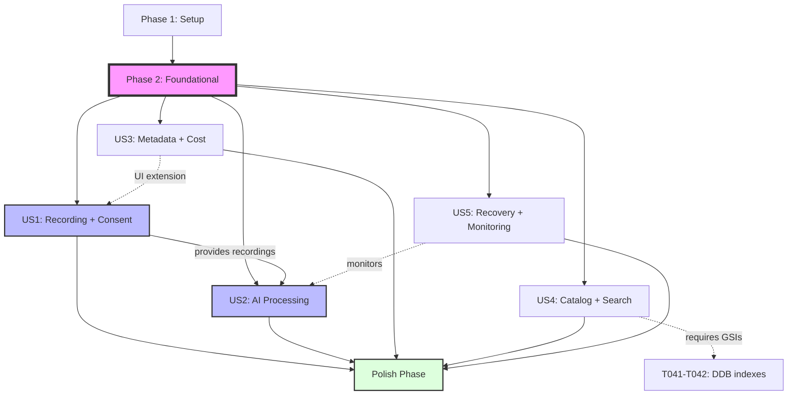

# Tasks: Meeting Recorder with AI Intelligence

Input: Design documents from `/specs/001-meeting-recorder-ai/`
Prerequisites: plan.md (required), spec.md (required), research.md (decisions), data-model.md (entities), contracts/ (schemas)

Tests: INCLUDED (TDD) — explicit test tasks are defined per user story and should be written to fail before implementation.

Organization: Tasks are grouped by user story to enable independent implementation and testing of each story.

## Format: `[ID] [P?] [Story] Description`

- [P]: Can run in parallel (different files, no dependencies)
- [Story]: Which user story this task belongs to (e.g., US1, US2, US3)
- All descriptions include exact file paths

## Phase 1: Setup (Shared Infrastructure)

Purpose: Project initialization and basic structure

- [ ] T001 Create repository structure per plan in repo root (macos/, processing/, infra/, scripts/, docs/)
- [ ] T002 Initialize Xcode project in macos/MeetingRecorder.xcodeproj and app entry macos/App/MeetingRecorderApp.swift
- [ ] T003 [P] Create Python lambda scaffolding with requirements in processing/lambdas/requirements.txt (boto3, jsonschema)
- [ ] T004 [P] Add .gitignore files for macOS and Python in macos/.gitignore and processing/.gitignore
- [ ] T005 [P] Configure linting/formatting: macos/.swiftlint.yml and processing/.ruff.toml

### Test scaffolding (shared)

- [ ] T057 [P] Initialize Python test runner in processing/ (processing/pyproject.toml or processing/pytest.ini; add processing/tests/ folders)
- [ ] T058 [P] Create Swift test targets in Xcode and directories macos/Tests/ and macos/UITests/ with sample failing tests
- [ ] T059 [P] Add test fixtures folder processing/tests/fixtures/ with sample transcript.json and summary.json placeholders

---

## Phase 2: Foundational (Blocking Prerequisites)

Purpose: Core infrastructure that MUST be complete before ANY user story can be implemented

- [ ] T006 Create Terraform scaffolding in infra/terraform/main.tf (providers, backend, variables)
- [ ] T007 [P] Define S3 bucket with SSE-S3 and TLS-only policy in infra/terraform/s3.tf (users/{user_id}/ prefixes)
- [ ] T008 [P] Define DynamoDB table "meetings" with PK `user_id#recording_id` and GSI-1 DateSearch in infra/terraform/dynamodb.tf
- [ ] T009 [P] Define IAM roles/policies for macOS app and Lambdas in infra/terraform/iam.tf (least-privilege; deny non-TLS)
- [ ] T010 Implement Firebase → STS credentials exchange Lambda in processing/lambdas/auth_exchange/handler.py
- [ ] T011 [P] macOS AWS config constants in macos/Services/AWSConfig.swift (region, bucket, table, identity provider endpoint)
- [ ] T012 [P] macOS structured logger in macos/Services/Logger.swift (no PII)
- [ ] T013 [P] Shared Python logging helper in processing/shared/logging.py (JSON logs, no PII)
- [ ] T014 Define local upload manifest model in macos/Models/UploadManifest.swift (chunk_id, path, size, checksum, attempts, last_error)
- [ ] T015 Config management stubs: macos/Services/Config.swift and processing/shared/config.py

Checkpoint: Foundation ready — user story implementation can now begin in parallel

---

## Phase 3: User Story 1 — Private screen recording with consent and indicator (Priority: P1) 🎯 MVP

Goal: Record private screen sessions with explicit consent and a persistent on-screen indicator; pause/resume; basic catalog entry after stop.

Independent Test: Complete a 2–5 minute recording; indicator visible throughout; session appears in catalog with date/time/duration; playback works locally.

### Tests for User Story 1 (TDD)

> Write these tests FIRST; ensure they fail before implementation.

- [ ] T060 [P] [US1] Unit test: screen segmentation at 60s in macos/Tests/ScreenRecorderTests.swift
- [ ] T061 [P] [US1] Unit test: upload queue backoff and resume from manifest in macos/Tests/UploadQueueTests.swift
- [ ] T062 [P] [US1] UI test: consent flow and persistent indicator visibility in macos/UITests/ConsentAndIndicatorUITests.swift
- [ ] T063 [P] [US1] Integration test: CatalogService.createSession writes pending item in macos/Tests/CatalogServiceTests.swift

### Implementation for User Story 1

- [ ] T016 [P] [US1] Consent dialog and first-run acknowledgment in macos/UI/ConsentView.swift
- [ ] T017 [P] [US1] Recording indicator overlay in macos/UI/RecordingIndicatorView.swift
- [ ] T018 [P] [US1] Screen capture controller (AVFoundation) in macos/Recording/ScreenRecorder.swift (60s segmentation)
- [ ] T019 [P] [US1] Chunk writer with temp storage and integrity checks in macos/Recording/ChunkWriter.swift
- [ ] T020 [US1] S3 multipart uploader with background retry in macos/Services/S3Uploader.swift (uses UploadManifest)
- [ ] T021 [US1] Upload queue/backoff worker in macos/Services/UploadQueue.swift (resume on app restart)
- [ ] T022 [US1] CatalogService.createSession to write DynamoDB item in macos/Services/CatalogService.swift (status=pending, s3_paths.chunks)
- [ ] T023 [US1] Record controls (start/pause/resume/stop) UI in macos/UI/RecordControlView.swift (binds to ScreenRecorder)
- [ ] T024 [US1] Minimal CatalogList to show new session in macos/UI/CatalogListView.swift (date/time/duration)
- [ ] T025 [US1] Wire app navigation in macos/App/MeetingRecorderApp.swift (Consent → Record → Catalog)

Checkpoint: US1 fully functional and testable independently

Parallel example for US1:

- Models/UI in T016–T019 can proceed in parallel; T020–T022 depend on them; T023–T025 integrate.

---

## Phase 4: User Story 2 — Automated transcript, summary, actions, decisions (Priority: P1)

Goal: On request, produce transcript with speaker labels, summary with timestamp links, action items, and key decisions; store artifacts in S3 and update status in DynamoDB.

Independent Test: Feed an existing recording; verify transcript, summary, action items, and decisions written to S3 with timestamp provenance; DynamoDB item updated to completed.

### Tests for User Story 2 (TDD)

> Write these tests FIRST; schema contracts must validate.

- [ ] T064 [P] [US2] Contract test: transcript JSON validates against contracts/schemas/transcript.schema.json in processing/tests/contracts/test_transcript_schema.py
- [ ] T065 [P] [US2] Contract test: summary JSON validates against contracts/schemas/summary.schema.json in processing/tests/contracts/test_summary_schema.py
- [ ] T066 [P] [US2] Integration test: DDB status transitions (pending→processing→completed/failed) in processing/tests/integration/test_ddb_updates.py
- [ ] T067 [P] [US2] Unit test: FFmpeg concat list builder in processing/tests/unit/test_process_video.py

### Implementation for User Story 2

- [ ] T026 [P] [US2] Fargate container for FFmpeg in processing/fargate/Dockerfile and processing/fargate/process_video.py
- [ ] T027 [P] [US2] StartProcessing Lambda (S3 event → Step Functions) in processing/lambdas/start_processing/handler.py
- [ ] T028 [P] [US2] Step Functions definition in infra/terraform/stepfunctions.tf (ASL JSON and IAM)
- [ ] T029 [P] [US2] StartTranscribe Lambda in processing/lambdas/start_transcribe/handler.py (batch job, custom vocab optional)
- [ ] T030 [P] [US2] BedrockSummarize Lambda in processing/lambdas/bedrock_summarize/handler.py (invoke model; parse and store summary)
- [ ] T031 [US2] Event wiring (S3 → EventBridge → Step Functions) in infra/terraform/events.tf
- [ ] T032 [US2] Shared DDB update helpers in processing/shared/ddb_updates.py (status transitions, progress)
- [ ] T033 [US2] Write transcript JSON to S3 per contracts/schemas/transcript.schema.json in processing/lambdas/start_transcribe/write_transcript.py
- [ ] T034 [US2] Write summary JSON to S3 per contracts/schemas/summary.schema.json in processing/lambdas/bedrock_summarize/write_summary.py
- [ ] T035 [US2] Processing trigger from macOS (finalize uploads + “process” action) in macos/Services/ProcessingService.swift
- [ ] T036 [US2] UI “Process” button on session row in macos/UI/ProcessButton.swift

Checkpoint: US1 and US2 both work independently (US2 can run on existing recordings)

Parallel example for US2:

- T026–T030 can proceed in parallel; T031 depends on Step Functions; T033–T034 follow Lambdas; T035–T036 integrate with macOS app.

---

## Phase 5: User Story 3 — Post-recording metadata capture (Priority: P2)

Goal: Allow editing participants, title, and tags; show processing cost estimate before proceeding.

Independent Test: Complete metadata form; see estimated cost; save without starting processing.

### Tests for User Story 3 (TDD)

> Write these tests FIRST; validate cost formula and form submission.

- [ ] T068 [P] [US3] Unit test: CostEstimator formula accuracy within ±25% in macos/Tests/CostEstimatorTests.swift
- [ ] T069 [P] [US3] UI test: metadata form validation and save without processing in macos/UITests/MetadataFormUITests.swift

### Implementation for User Story 3

- [ ] T037 [P] [US3] Metadata form view in macos/UI/MetadataFormView.swift (participants, title, tags)
- [ ] T038 [P] [US3] CostEstimator implementing research formula in macos/Services/CostEstimator.swift (writes cost_estimate_usd)
- [ ] T039 [US3] CatalogService.updateMetadata in macos/Services/CatalogService.swift (update DDB item + denorm later)
- [ ] T040 [US3] Integrate estimate + confirm/cancel processing in macos/UI/MetadataFormView.swift

Checkpoint: US3 independently functional on top of US1

Parallel example for US3:

- T037 and T038 can run in parallel; T039 follows; T040 integrates UI actions.

---

## Phase 6: User Story 4 — Catalog and search (Priority: P2)

Goal: Browse sessions; filter by date, participants, or tags; open summary and transcript with timestamp navigation.

Independent Test: With ≥10 sessions, find a target by participant or date and open summary within a few seconds.

### Tests for User Story 4 (TDD)

> Write these tests FIRST; validate search indexes and UI navigation.

- [ ] T070 [P] [US4] Integration test: search index key shapes for participants/tags in processing/tests/integration/test_search_indexes.py
- [ ] T071 [P] [US4] UI test: catalog filter by participant/date and open detail in macos/UITests/CatalogSearchUITests.swift
- [ ] T072 [P] [US4] Unit test: transcript viewer timestamp navigation in macos/Tests/TranscriptViewerTests.swift

### Implementation for User Story 4

- [ ] T041 [P] [US4] Add GSIs for participants and tags in infra/terraform/dynamodb.tf (ParticipantSearch, TagSearch)
- [ ] T042 [P] [US4] Denormalized writes (participants/tags) in processing/shared/index_writes.py and macos/Services/CatalogService.swift
- [ ] T043 [P] [US4] Catalog view with filters in macos/UI/CatalogView.swift (date, participant, tag)
- [ ] T044 [US4] Session detail with transcript viewer and timestamp navigation in macos/UI/SessionDetailView.swift and macos/UI/TranscriptViewer.swift
- [ ] T045 [US4] Video playback view in macos/UI/VideoPlayerView.swift (seek by timestamp)

Checkpoint: US4 independently functional using existing data

Parallel example for US4:

- T041–T043 can run in parallel (infra + app view); T044–T045 integrate viewing flows.

---

## Phase 7: User Story 5 — Error recovery and monitoring (Priority: P2)

Goal: Show processing status; allow retry on failure; notify on completion/failure; show cost breakdown for completed sessions.

Independent Test: Simulate a Transcribe failure; user sees failure, retries, and succeeds; notifications appear appropriately.

### Tests for User Story 5 (TDD)

> Write these tests FIRST; validate status polling, retry, and notifications.

- [ ] T073 [P] [US5] Unit test: StatusService state mapping and progress in macos/Tests/StatusServiceTests.swift
- [ ] T074 [P] [US5] Integration test: simulated Transcribe failure triggers retry path in processing/tests/integration/test_retry_flow.py
- [ ] T075 [P] [US5] UI test: local notifications on completion/failure in macos/UITests/NotificationsUITests.swift

### Implementation for User Story 5

- [ ] T046 [P] [US5] Status polling service in macos/Services/StatusService.swift (reads DDB status/progress)
- [ ] T047 [P] [US5] Retry processing in macos/Services/ProcessingService.swift (re-invoke Step Functions for recording_id)
- [ ] T048 [P] [US5] Local notifications integration in macos/Services/NotificationService.swift (completion/failure)
- [ ] T049 [US5] Cost breakdown UI in macos/UI/CostBreakdownView.swift (Transcribe, Bedrock, Storage)

Checkpoint: US5 independently demonstrable on existing sessions

Parallel example for US5:

- T046–T048 can run in parallel; T049 integrates UI for costs.

---

## Final Phase: Polish & Cross-Cutting Concerns

Purpose: Improvements that affect multiple user stories

- [ ] T050 [P] Documentation update and validation script in scripts/validate_quickstart.sh (ensure quickstart.md steps match)
- [ ] T051 Code cleanup and refactoring across macos/ and processing/
- [ ] T052 [P] Performance optimization: uploader concurrency and FFmpeg presets in macos/Services/S3Uploader.swift and processing/fargate/process_video.py
- [ ] T053 Security hardening: redact PII in logs, HTTPS enforcement checks in processing/shared/logging.py and infra/terraform/s3.tf
- [ ] T054 Implement deletion workflow per FR-011 in processing/lambdas/delete_session/handler.py and macos/UI/DeleteSessionButton.swift
- [ ] T055 Configure S3 lifecycle/retention policies in infra/terraform/s3_lifecycle.tf (per data-model.md)
- [ ] T056 [P] Baseline evaluation runner per docs/eval.md in scripts/run_eval.sh

---

## Dependencies & Execution Order

### Phase Dependencies

- Setup (Phase 1): No dependencies — start immediately
- Foundational (Phase 2): Depends on Setup completion — BLOCKS all user stories
- User Stories (Phases 3–7): Each depends on Foundational; can proceed in priority order or in parallel
- Polish (Final): After desired stories are complete

### User Story Dependencies

- US1 (P1): Can start after Foundational — no dependencies on other stories
- US2 (P1): Can start after Foundational — runs on existing recordings, independent of US3–US5
- US3 (P2): Builds on US1 UI; otherwise independent
- US4 (P2): Requires DDB GSIs (T041) and denorm writes (T042)
- US5 (P2): Independent once US2 produces statuses; can run on existing data

### Within Each User Story

- Tests first (TDD): Write and verify they fail
- Models/UI can proceed in parallel [P]
- Services integrate afterward
- Story should be complete and testable independently before moving on

### Visual Dependency Graph

**Legend:**

- Solid arrows: Hard dependencies (must complete before starting)
- Dashed arrows: Soft dependencies (integration points, not blocking)
- Purple (P2): Blocking foundation phase
- Blue (US1/US2): P1 priority stories (MVP candidates)
- Green (Polish): Final cross-cutting improvements

---

## Implementation Strategy

MVP First (US1 only):

1. Complete Phase 1: Setup
2. Complete Phase 2: Foundational (CRITICAL)
3. Complete Phase 3: US1
4. Stop and validate — demonstrate recording with indicator and catalog entry

Incremental Delivery:

- Add US2 → validate on existing recordings
- Add US3 → validate metadata without processing
- Add US4 → validate catalog/search on 10+ sessions
- Add US5 → validate retry/notifications/costs

Parallel Team Strategy:

- After Foundational, separate owners for macOS (US1/US3/US4/US5) and backend pipeline (US2)

---

## Summary Report

Output path: `/specs/001-meeting-recorder-ai/tasks.md`

- **Total tasks: 75** (includes 19 test tasks + 3 test scaffolding tasks)
- Task count per user story:
  - **US1: 14 tasks** (T016–T025 implementation + T060–T063 tests)
  - **US2: 15 tasks** (T026–T036 implementation + T064–T067 tests)
  - **US3: 6 tasks** (T037–T040 implementation + T068–T069 tests)
  - **US4: 8 tasks** (T041–T045 implementation + T070–T072 tests)
  - **US5: 7 tasks** (T046–T049 implementation + T073–T075 tests)
- **Parallel opportunities identified: 46 tasks marked [P]** (33 implementation + 13 test tasks)
- Independent test criteria (TDD):
  - US1: 4 test tasks (unit, integration, UI) verify recording, consent, indicator, and catalog
  - US2: 4 test tasks (contract, integration, unit) verify schema compliance and pipeline flow
  - US3: 2 test tasks (unit, UI) verify cost formula accuracy and metadata submission
  - US4: 3 test tasks (integration, UI, unit) verify search indexes and timestamp navigation
  - US5: 3 test tasks (unit, integration, UI) verify status polling, retry logic, and notifications
- Suggested MVP scope: **US1 only (Phases 1–3)** — delivers immediate value and unblocks subsequent automation work
- Format validation: All tasks follow `- [ ] T### [P?] [US?] Description with file path` (Setup/Foundational/Polish omit [US]; User Story tasks include [USn])
- **Visual dependency graph included** (Mermaid diagram showing phase and story relationships)
