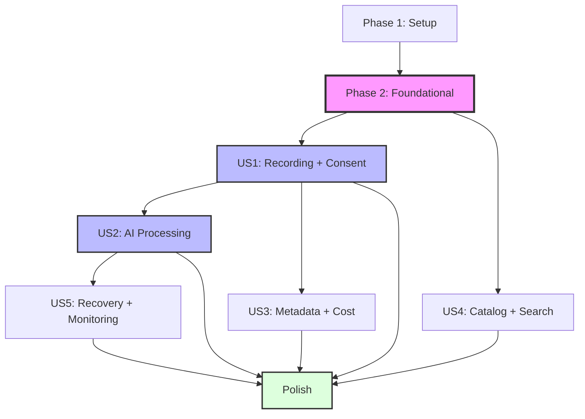

# Tasks: Meeting Recorder with AI Intelligence

**Input**: Design documents from `/specs/001-meeting-recorder-ai/`
**Prerequisites**: plan.md, spec.md, data-model.md, quickstart.md, contracts/schemas/

**Tests**: TDD is mandatory. Each user story phase begins with failing test tasks before implementation.

**Organization**: Tasks are grouped by user story so each slice is independently deliverable and testable.

## Format: `[ID] [P?] [Story] Description`

- `[P]`: Task is parallelizable (no dependency on other incomplete work and touches different files)
- `[Story]`: User story label (`[US1]`, `[US2]`, etc.) — omitted for setup/foundational/polish phases
- Every description includes explicit file paths

---

## Phase 1: Setup (Shared Infrastructure)

**Purpose**: Establish macOS project scaffolding, dependencies, and baseline configs.

- [x] T001 Create SwiftUI app project and workspace in `macos/MeetingRecorder.xcodeproj` with source root `macos/Sources/MeetingRecorder/`
- [x] T002 Add Swift Package manifest with AWS SDK for Swift + Firebase dependencies in `macos/Package.swift`
- [x] T003 [P] Configure linting rules in `macos/.swiftlint.yml`
- [x] T004 [P] Initialize XCTest targets with placeholder failing specs in `macos/Tests/MeetingRecorderTests/` and `macos/Tests/MeetingRecorderUITests/`
- [x] T005 [P] Add screen-recording consent usage keys in `macos/Resources/Info.plist`
- [x] T006 [P] Set environment configuration placeholders in `macos/Configs/Development.xcconfig` and `macos/Configs/Production.xcconfig`

---

## Phase 2: Foundational (Blocking Prerequisites)

**Purpose**: Core services shared by all stories — complete before any feature work.

- [x] T007 Implement configuration singleton in `macos/Sources/MeetingRecorder/Services/Config.swift`
- [x] T008 [P] Provide AWS constants and region handling in `macos/Sources/MeetingRecorder/Services/AWSConfig.swift`
- [x] T009 [P] Set up structured logging without PII in `macos/Sources/MeetingRecorder/Services/Logger.swift`
- [x] T010 [P] Persist auth tokens securely via keychain in `macos/Sources/MeetingRecorder/Services/AuthSession.swift`
- [x] T011 [P] Exchange Firebase ID tokens for STS credentials in `macos/Sources/MeetingRecorder/Services/CredentialExchangeService.swift`
- [x] T012 [P] Define chunk manifest model and persistence in `macos/Sources/MeetingRecorder/Models/UploadManifest.swift`
- [x] T013 [P] Build reusable S3 client factory in `macos/Sources/MeetingRecorder/Services/S3ClientFactory.swift`
- [x] T014 [P] Build DynamoDB client factory in `macos/Sources/MeetingRecorder/Services/DynamoDBClientFactory.swift`

**Checkpoint**: Config, logging, credential exchange, and AWS client factories are ready for downstream stories.

---

## Phase 3: User Story 1 — Private screen recording with consent and indicator (Priority: P1) 🎯

**Goal**: Record desktop with explicit consent, show persistent indicator, segment into 60-second chunks, queue uploads, and register session in catalog.

**Independent Test**: User completes a 5-minute recording; indicator remains visible; DynamoDB shows pending session with duration and S3 chunk prefix.

- [x] T015 [P] [US1] Add segmentation unit tests in `macos/Tests/MeetingRecorderTests/ScreenRecorderTests.swift`
- [x] T016 [P] [US1] Add upload queue persistence tests in `macos/Tests/MeetingRecorderTests/UploadQueueTests.swift`
- [x] T017 [P] [US1] Add consent + indicator UI test in `macos/Tests/MeetingRecorderUITests/IndicatorFlowUITests.swift`
- [x] T018 [P] [US1] Add catalog creation integration test in `macos/Tests/MeetingRecorderTests/CatalogServiceTests.swift`

- [x] T015 [P] [US1] Add segmentation unit tests in `macos/Tests/MeetingRecorderTests/ScreenRecorderTests.swift`
- [x] T016 [P] [US1] Add upload queue persistence tests in `macos/Tests/MeetingRecorderTests/UploadQueueTests.swift`
- [x] T017 [P] [US1] Add consent + indicator UI test in `macos/Tests/MeetingRecorderUITests/IndicatorFlowUITests.swift`
- [x] T018 [P] [US1] Add catalog creation integration test in `macos/Tests/MeetingRecorderTests/CatalogServiceTests.swift`

- [ ] T060 [P] [US1] Unit test: screen segmentation at 60s in macos/Tests/ScreenRecorderTests.swift
- [ ] T061 [P] [US1] Unit test: upload queue backoff and resume from manifest in macos/Tests/UploadQueueTests.swift
- [ ] T062 [P] [US1] UI test: consent flow and persistent indicator visibility in macos/UITests/ConsentAndIndicatorUITests.swift
- [ ] T063 [P] [US1] Integration test: CatalogService.createSession writes pending item in macos/Tests/CatalogServiceTests.swift

### Implementation for User Story 1

- [x] T019 [P] [US1] Build consent acknowledgement view in `macos/Sources/MeetingRecorder/UI/ConsentView.swift`
- [x] T020 [P] [US1] Build recording indicator overlay in `macos/Sources/MeetingRecorder/UI/RecordingIndicatorOverlay.swift`
- [x] T021 [P] [US1] Implement AVFoundation screen recorder in `macos/Sources/MeetingRecorder/Recording/ScreenRecorder.swift`
- [x] T022 [P] [US1] Implement chunk writer with checksum handling in `macos/Sources/MeetingRecorder/Recording/ChunkWriter.swift`
- [x] T023 [US1] Implement S3 multipart uploader in `macos/Sources/MeetingRecorder/Services/S3Uploader.swift`
- [x] T024 [US1] Implement background upload queue worker in `macos/Sources/MeetingRecorder/Services/UploadQueue.swift`
- [x] T025 [US1] Implement catalog session writer in `macos/Sources/MeetingRecorder/Services/CatalogService.swift`
- [x] T026 [US1] Build recording controls view in `macos/Sources/MeetingRecorder/UI/RecordControlView.swift`
- [x] T027 [US1] Build catalog list view showing pending sessions in `macos/Sources/MeetingRecorder/UI/CatalogListView.swift`
- [x] T028 [US1] Wire app navigation state in `macos/Sources/MeetingRecorder/App/MeetingRecorderApp.swift`

**Checkpoint**: Recording, consent compliance, and catalog registration validated by tests.

**Parallel example**: T019–T022 can proceed concurrently; T023–T025 integrate services; T026–T028 tie UI flows together.

---

## Phase 4: User Story 2 — Automated transcript, summary, actions, decisions (Priority: P1)

**Goal**: Process completed recordings via AWS pipeline to produce transcript, summary, action items, and decisions with provenance.

**Independent Test**: Submitting a completed session triggers pipeline, writes contract-compliant JSON artifacts to S3, and updates DynamoDB status to `completed`.

### Tests for User Story 2 (write first)

- [ ] T029 [P] [US2] Validate transcript JSON against schema in `processing/tests/contracts/test_transcript_schema.py`
- [ ] T030 [P] [US2] Validate summary JSON against schema in `processing/tests/contracts/test_summary_schema.py`
- [ ] T031 [P] [US2] Verify status transitions across Step Functions in `processing/tests/integration/test_state_transitions.py`
- [ ] T032 [P] [US2] Unit test Step Functions input builder in `processing/tests/unit/test_step_input_builder.py`

### Implementation for User Story 2

- [ ] T033 [P] [US2] Build FFmpeg Fargate task in `processing/fargate/Dockerfile` and `processing/fargate/process_video.py`
- [ ] T034 [P] [US2] Complete start_processing Lambda in `processing/lambdas/start_processing/handler.py`
- [ ] T035 [P] [US2] Define Step Functions state machine in `infra/terraform/stepfunctions.tf`
- [ ] T036 [P] [US2] Complete start_transcribe Lambda in `processing/lambdas/start_transcribe/handler.py`
- [ ] T037 [P] [US2] Complete bedrock_summarize Lambda in `processing/lambdas/bedrock_summarize/handler.py`
- [ ] T038 [US2] Centralize artifact writing (pipeline/model version metadata) in `processing/shared/artifact_writer.py`
- [ ] T039 [US2] Wire event sources (S3 → EventBridge → Step Functions) in `infra/terraform/eventbridge.tf`
- [ ] T040 [US2] Add DynamoDB status helper utilities in `processing/shared/ddb_updates.py`
- [ ] T041 [US2] Trigger processing from macOS client in `macos/Sources/MeetingRecorder/Services/ProcessingService.swift`
- [ ] T042 [US2] Add processing action control in `macos/Sources/MeetingRecorder/UI/ProcessButton.swift`

**Checkpoint**: Pipeline produces artifacts, updates status, and macOS client initiates runs.

**Parallel example**: T033–T037 proceed in parallel; infra wiring in T035 + T039 follows; T041–T042 integrate macOS UI.

---

## Phase 5: User Story 3 — Post-recording metadata capture (Priority: P2)

**Goal**: Allow editing metadata (participants, title, tags) and show cost estimate prior to processing consent.

**Independent Test**: Metadata form saves without triggering processing; cost estimate matches formula within ±25% of backend projections.

### Tests for User Story 3 (write first)

- [ ] T043 [P] [US3] Verify cost estimator math in `macos/Tests/MeetingRecorderTests/CostEstimatorTests.swift`
- [ ] T044 [P] [US3] Verify metadata form UX in `macos/Tests/MeetingRecorderUITests/MetadataFormUITests.swift`

### Implementation for User Story 3

- [ ] T045 [P] [US3] Build metadata form UI in `macos/Sources/MeetingRecorder/UI/MetadataFormView.swift`
- [ ] T046 [P] [US3] Implement cost estimator service in `macos/Sources/MeetingRecorder/Services/CostEstimator.swift`
- [ ] T047 [US3] Extend catalog service to update metadata in `macos/Sources/MeetingRecorder/Services/CatalogService.swift`
- [ ] T048 [US3] Connect confirm/cancel processing decisions in `macos/Sources/MeetingRecorder/UI/MetadataFormView.swift`

**Checkpoint**: User can adjust metadata and review cost before opting into processing.

---

## Phase 6: User Story 4 — Catalog and search (Priority: P2)

**Goal**: Provide catalog browsing with participant/tag/date filters and transcript navigation with timestamp syncing to playback.

**Independent Test**: With seeded data, user locates sessions via filters and navigates to transcript segments with synchronized playback.

### Tests for User Story 4 (write first)

- [ ] T049 [P] [US4] Verify denormalized search indexes in `processing/tests/integration/test_search_indexes.py`
- [ ] T050 [P] [US4] Verify catalog filter flows in `macos/Tests/MeetingRecorderUITests/CatalogSearchUITests.swift`
- [ ] T051 [P] [US4] Verify transcript navigation behavior in `macos/Tests/MeetingRecorderTests/TranscriptViewerTests.swift`

### Implementation for User Story 4

- [ ] T052 [P] [US4] Add participant/tag GSIs in `infra/terraform/dynamodb.tf`
- [ ] T053 [P] [US4] Write denormalized participant/tag items in `processing/shared/index_writes.py`
- [ ] T054 [P] [US4] Build catalog filter view in `macos/Sources/MeetingRecorder/UI/CatalogView.swift`
- [ ] T055 [US4] Build session detail view in `macos/Sources/MeetingRecorder/UI/SessionDetailView.swift`
- [ ] T056 [US4] Build transcript viewer with timestamp links in `macos/Sources/MeetingRecorder/UI/TranscriptViewer.swift`
- [ ] T057 [US4] Build video player with seek support in `macos/Sources/MeetingRecorder/UI/VideoPlayerView.swift`

**Checkpoint**: Rich catalog browsing and playback experiences validated.

---

## Phase 7: User Story 5 — Error recovery and monitoring (Priority: P2)

**Goal**: Surface processing status, support retries, deliver notifications, and show cost breakdown for completed runs.

**Independent Test**: Simulated failure surfaces retry action; retry succeeds; notifications sent; cost breakdown visible.

### Tests for User Story 5 (write first)

- [ ] T058 [P] [US5] Verify status mapping logic in `macos/Tests/MeetingRecorderTests/StatusServiceTests.swift`
- [ ] T059 [P] [US5] Verify retry workflow against mocked failure in `processing/tests/integration/test_retry_flow.py`
- [ ] T060 [P] [US5] Verify notifications UX in `macos/Tests/MeetingRecorderUITests/NotificationsUITests.swift`

### Implementation for User Story 5

- [ ] T061 [P] [US5] Implement status polling service in `macos/Sources/MeetingRecorder/Services/StatusService.swift`
- [ ] T062 [P] [US5] Add retry orchestration to `macos/Sources/MeetingRecorder/Services/ProcessingService.swift`
- [ ] T063 [P] [US5] Implement notification manager in `macos/Sources/MeetingRecorder/Services/NotificationService.swift`
- [ ] T064 [US5] Add cost breakdown UI in `macos/Sources/MeetingRecorder/UI/CostBreakdownView.swift`

**Checkpoint**: Users monitor progress, retry failures, and review cost transparency.

---

## Final Phase: Polish & Cross-Cutting Concerns

**Purpose**: Hardening, documentation, retention, and evaluation tasks spanning multiple stories.

- [ ] T065 [P] Update quickstart documentation in `specs/001-meeting-recorder-ai/quickstart.md`
- [ ] T066 Add validation script for setup steps in `scripts/validate_quickstart.sh`
- [ ] T067 [P] Implement deletion workflow in `processing/lambdas/delete_session/handler.py` and `macos/Sources/MeetingRecorder/UI/DeleteSessionButton.swift`
- [ ] T068 [P] Configure lifecycle policies per schema in `infra/terraform/s3_lifecycle.tf`
- [ ] T069 Optimize uploader concurrency and FFmpeg presets in `macos/Sources/MeetingRecorder/Services/S3Uploader.swift` and `processing/fargate/process_video.py`
- [ ] T070 [P] Add evaluation runner per `docs/eval.md` in `scripts/run_eval.sh`

---

## Dependencies & Execution Order

### Phase Dependencies

- Setup (Phase 1) → Foundational (Phase 2) → User Stories (Phases 3–7) → Polish
- No user story may begin before Phase 2 completes.

### User Story Dependencies

- **US1**: First deliverable; feeds uploads for later stories.
- **US2**: Requires US1 recordings but otherwise independent of US3–US5.
- **US3**: Extends US1 catalog UI only; no hard dependency on US2.
- **US4**: Needs GSIs (T052) and denormalized writes (T053) but can start once Phase 2 complete.
- **US5**: Relies on pipeline status updates from US2.

### Within Each User Story

- Execute tests (TDD) before implementation tasks.
- Tasks marked `[P]` can proceed concurrently once prerequisites exist.
- Complete each user story before moving to the next priority slice.

### Visual Dependency Graph

---

## Implementation Strategy

**MVP First**

1. Complete Phases 1 & 2.
2. Ship Phase 3 (US1) and validate full recording flow.

**Incremental Delivery**

- Add US2 for automated processing; validate with existing recordings.
- Add US3 for metadata + cost guardrails.
- Add US4 for catalog/search navigation.
- Add US5 for reliability + observability.

**Parallel Opportunities**

- After Phase 2, backend focus on US2 while client focus starts US1/US3.
- Many `[P]` tasks spread across independent files for concurrent execution.

---

## Summary Report

**Output path**: `/specs/001-meeting-recorder-ai/tasks.md`

- **Total tasks**: 70
- **Per user story**:
  - US1: 10 implementation + 4 tests = 14 tasks (T015–T028)
  - US2: 10 implementation + 4 tests = 14 tasks (T029–T042)
  - US3: 4 implementation + 2 tests = 6 tasks (T043–T048)
  - US4: 6 implementation + 3 tests = 9 tasks (T049–T057)
  - US5: 4 implementation + 3 tests = 7 tasks (T058–T064)
- **Parallel tasks**: 40 marked `[P]` across phases for team concurrency.
- **Independent test criteria**: Each story begins with TDD tasks covering unit, UI, and integration aspects aligned to acceptance scenarios.
- **Suggested MVP scope**: Phases 1–3 (US1) deliver recording with consent; subsequent stories add automation, metadata, search, and reliability.
- **Format validation**: All entries follow `- [ ] T### [P?] [US?] Description with path`.
